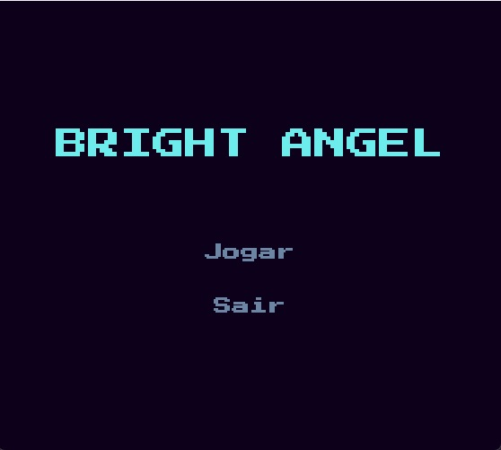
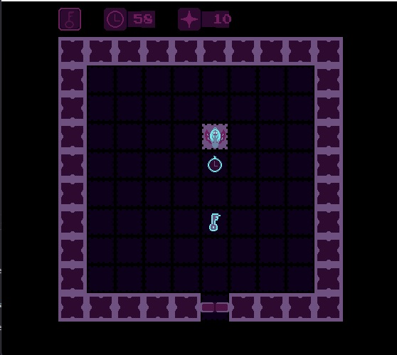
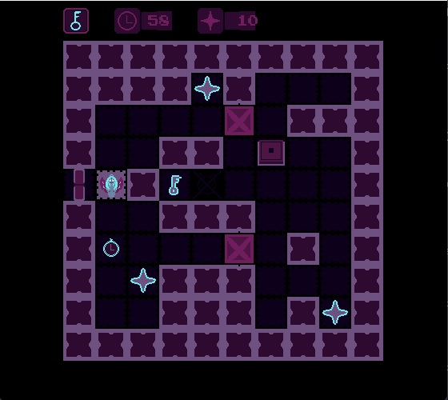
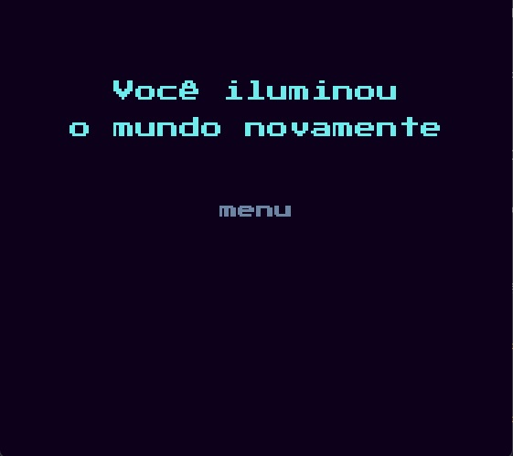

# Bright Angel

<!-- TABLE OF CONTENTS -->

  
<h2 style="display: inline-block">Sumário</h2>

  <ol>
    <li><a href="#game-history">História do jogo</a></li>
    <li><a href="#gameplay">Gameplay</a></li>
    <li><a href="#controles">Controles</a></li>
    <li><a href="#level-design">Level Design</a></li>
    <li><a href="#tecnologies">Tecnologias</a></li>
    <li><a href="#how-to-run">Como Rodar</a></li>
    <li><a href="#code-organization">Organização do Projeto</a></li>
    <li><a href="#tiles-labels">Legenda das tiles</a></li>
    <li><a href="#labor-division">Divisão de tarefas</a></li>
    <li><a href="#concept">Conceitos usados no projeto</a></li>
		<li><a href="#erros-aprendizados">Erros e Aprendizados</a></li>
    <li><a href="#references">Referências</a></li>
    <li><a href="#galery">Galeria</a></li>
  </ol>

<h2 id="game-history">
	História do jogo
</h2>

	A anja brilhante se encontra num labirinto e ela tem que encontrar a chave do portão para escapar do labirinto antes que sua energia vital acabe. Para isso a anja brilhante deve encontrar colétaveis que aumentam sua energia vital que tornando-a capaz de andar de percorrer o labirinto ou aumentar o tempo para a procura da sua escapatória. Ajude ela guiando o caminho que ela deve percorrer para escapar do labirinto. Conto com voce para essa missão...

## Gameplay

	A jogabilidade envolve uma perspectiva de topo em que o jogador tem um número limitado de movimentos para navegar através de um ambiente baseado num quadriculado. Ao longo do caminho, tem de recolher três itens - CHAVES, bem como itens opcionais TEMPO e ENERGIA - para progredir através de vários obstáculos. O jogo também inclui puzzles lógicos que o jogador tem de resolver para avançar. O desafio consiste em gerir os movimentos limitados enquanto recolhe estrategicamente os itens necessários e resolve os puzzles, com a opção de escolher se quer ou não recolher TEMPO e ENERGIA para ajudar no seu progresso.

## Controles

	R  = Pressione 'R' para reiniciar a fase se sua energia (⚡) acabou.

	↑  = Move a anjinha brilhante para cima

	↓  = Move a anjinha brilhante para baixo

	←  = Move a anjinha brilhante para esquerda

	→  = Move a anjinha brilhante para direita

## Level Design

	O design dos níveis consiste em salas, cada uma com obstáculos e desafios. Algumas salas têm caixas arrastáveis que podem ser usadas para bloquear caminhos ou activar interruptores. Os formatos geométricos das salas foram concebidos para tornar mais complexos os movimentos do jogador e o controlo dos custos de energia.

    Por exemplo, algumas salas podem ter corredores estreitos que exigem que o jogador manobre cuidadosamente para evitar o desperdício de energia, enquanto outras podem ter grandes espaços abertos que permitem um movimento mais fácil, mas exigem mais energia para atravessar. As caixas arrastáveis podem aumentar a complexidade da resolução de puzzles, uma vez que o jogador tem de as posicionar estrategicamente para ultrapassar obstáculos e conservar energia.

    No geral, o design dos níveis é cuidadosamente concebido para proporcionar uma experiência desafiante mas gratificante aos jogadores à medida que avançam no jogo.

<h2 id="tecnologies">Tecnologias</h2>

<a href="https://www.python.org">
 Python 3
</a>

Requisito obrigatório do projeto

<a href="https://www.pygame.org/wiki/GettingStarted">
Pygame 2
</a>

Utilizamos o pygame porque é a biblioteca para jogos no ecosystema python mais popular, e ela realmente disponibiliza várias ferramentas que ajudou bastante o desenvolvimento do jogo, como a detecção de colisão entre objetos, detecção de inputs do teclado e mouse, um tratamento basico das imagens e etc... Além disso, como a finalidade do projeto é para é para colocarmos em prática o conhecimento em POO, ao utilizar o pygame isso é alcançado quase que naturalmente pois praticamente todo projeto vai precisar sprites e para usar isso vai ter que herdar da classe Sprite do pygame.

 

<a href="">OS</a>

biblioteca que ajuda achar o local correto de um arquivo no projeto

<!-- ## Como rodar o jogo? -->
<h2 id="how-to-run">Como rodar o jogo?</h2>

	O jogo requer que o Python e o Pygame estejam instalados no teu sistema. Instruções sobre como instalar o Python e o Pygame podem ser encontradas nos seus respectivos sites. Abra o <strong>main.py</strong> em project no terminal e rode 
	<code lang="python">
		python main.py
	</code>

<h2 id="code-organization">Organização do Projeto</h2>

<h3>main.py</h3>

		É o script principal do projeto, lá que o loop do jogo roda e interliga os componentes centrais do jogo

<h3>settings.py</h3> 

		É o "armazém" de dados do projeto, todos os dados estáticos, como: a estrutura das fazes, resolução do jogo, tamanho das tiles e etc..

<h3>player.py</h3>

	Tudo que o player realiza e suas interações com outros objetos são controlados nesse script.

<h3>map.py</h3>

Gera as tiles das fases, lendo a estrutura crua dos mapas e decidindo qual tile usar apartir das tags, além disso seta a posição do player

<h3>music.py</h3>

Lida com os sons do jogo, sendo músicas ou efeitos sonoros.

<h3>ui.py</h3>

Cuida de toda a interface do jogo, tanto na parte de criar em si os textos e botões, como de atualizar os seus conteúdos apartir de dados no main.py

<h3>tile.py</h3>

Classe abstrata das tiles do jogo

<h3>button.py</h3>

Classe especializada da tile que lida com as particularidades dos botões que abrem portões no jogo

<h3>box.py</h3>

Classe especializada da tile que lida com as particularidades das caixas do jogo

<h2 id="tiles-labels">Legenda das tiles no map</h2>
<ul>
<li>X -> tile das paredes</li>
<li>D(R,L, T, B) -> tile da porta e a rotação da porta</li>
<li>C -> tile do relógio</li>
<li>E -> tila do orb de energia</li>
<li>K -> tile da chave</li>
<li>B -> tile da caixa</li>
<li>P -> define a posição do player</li>
<li>T_coluna/linha -> tile dos botões, a coluna e linha são as posições da tile do bloco impassável</li>
</ul>

<h2 id="labor-division">Divisão de tarefas</h2>
<h3>Pedro Novaes</h3>

movimentação, colisão e arraste do player. Além disso ajudou na otimização da geração das tiles e da colisão das caixas

<h3>Gabriel Marvin</h3>

Sistema de Audio do jogo, e Além disso trabalou com Vinicius para criar a classe dos botões de ui

<h3>Daniel Lapa</h3>

Sistema de colisão das caixas, desenho do coletável a chave na tela e o sistema de botões em jogo que abre as tiles que não bloqueadas

<h3>Vinicius Nobre</h3>

Criou a o sistema da ui, sua classes e os métodos que ela tem

<h3>Marcos Vinicius</h3>

Criou o map.py e fez todo o sistema de geração das tiles

<h2 id="concepts">Como os conceitos aprendidos na disciplina foram usados no projeto</h2>

O projeto utilizou muito dos conceitos aprendidos na disciplina, mas os mais relevantes são:

<strong>listas</strong>  
extenso uso de listas para armazenar as tiles e gerenciar a sua geração, além disso utilizou pontualmente list comphresion para filtrar a lista das tiles, por deixar uma sintaxe bem enxuta e fácil de ler.

<strong>Dicionários</strong>  
para armazenar alguns dados estáticos como os sons.

<strong>Classes</strong>  
Utilizamos muitas classes, para a componentizar bastante o nosso projeto. para entender melhor o uso das classes no projeto pode checar o seu <a href="https://www.figma.com/file/UvtJcjRWoRzAYyCXSJ1rUL/Untitled">diagram UML</a>

<strong>Passar funções como argumento</strong>  

Para fazer a classe do ClicableRect ser genérica suficientemente para contemplar qualquer botão e deixar um código mais componentizado, fizemos com que a função que ele chame ao ser pressionado fosse vinda de um argumento na sua inicilização

<h2 id="erros-aprendizados">Erros e Aprendizados</h2>

<table>
  <tr>
  <td align="center"><b>Desafio Principal</b></td>
  <td align="center"><b>Como Resolvemos</b></td>
  <tr/>
  <td align="left">Utilização do git e github para o trabalho em equipe</td>
  <td align="left">Pesquisamos e pedimos ajuda ao lider do projeto para auxiliar o restante da equipe</td>
 </tr>
  <td align="center"><b>Erro Principal</b></td>
  <td align="center"><b>Como Resolvemos</b></td>
  <tr/>
  <td align="left">Divisão tardia das tarefas</td>
  <td align="left">Conseguimos nos reoorganizar e distribuir as tarefas de uma forma melhor realizando sprints diários com meets para decidir o que seria feito e mostrar o que foi feito ao líder</td>
 </tr>
 </tr>
 </table>
 
 <table>
  <td align="center"><b>Aprendizados</b></td>
  <tr/>
  <td align="left">
  <ul>
  <li>Trabalho em equipe</li>
  <li>Importância da comunicaçao para a tomada de decisões</li>
  <li>Versionamento de código Git e Github</li>
  <li>Pygame features</li>
  <li>Programação Orientada a Objetos (POO)</li>
  </ul>
  </td>
 </tr>
 </table>

<h2 id="references">Referências</h2>

	O jogo foi inspirado em The Talos Principle, Lara Croft GO, Monument Valley

<h2 id="galery">Galeria</h2>

